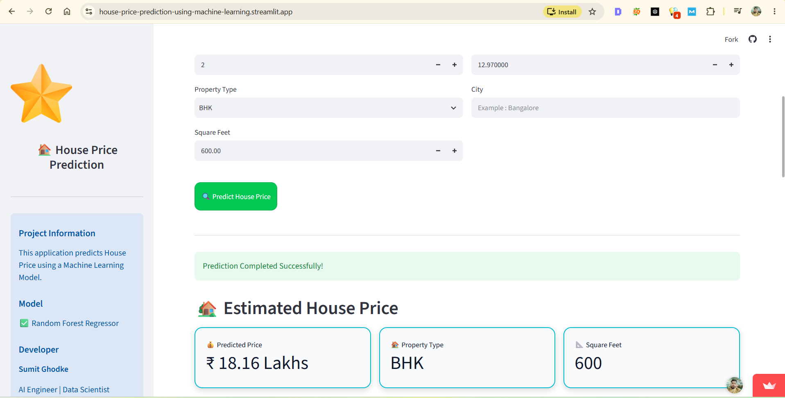
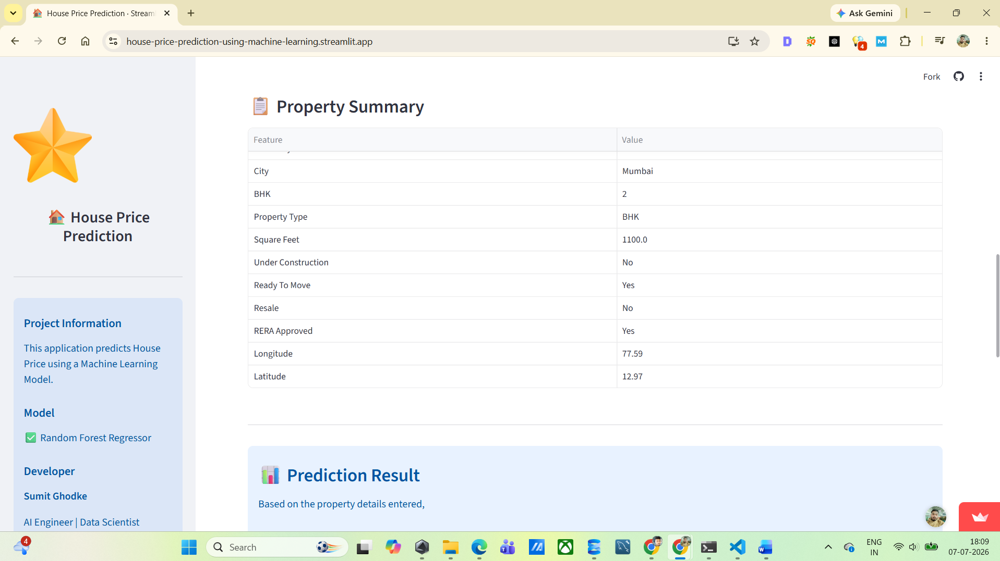
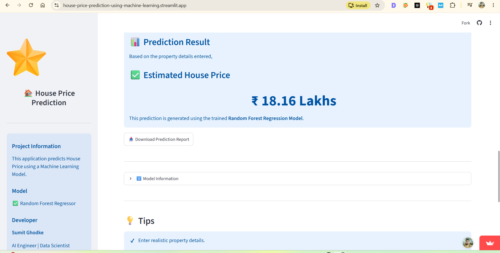

# 🏡 House Price Prediction using Machine Learning | Streamlit Web Application


---

## 📌 Project Overview

This project is an **End-to-End Machine Learning House Price Prediction System** developed as part of my **Machine Learning Capstone Project**.

The application predicts residential house prices using Machine Learning based on various property features such as:

- Property Type
- Location
- Construction Status
- Number of Bedrooms
- Square Feet Area
- Latitude & Longitude
- Ready to Move Status
- Resale Status
- RERA Approval

The project covers the complete Machine Learning lifecycle, including:

- Data Collection
- Data Cleaning
- Exploratory Data Analysis (EDA)
- Feature Engineering
- Feature Encoding
- Feature Scaling
- Model Development
- Model Evaluation
- Hyperparameter Tuning
- Cross Validation
- Streamlit Deployment

---

# 🚀 Live Demo

### 🌐 Streamlit Web Application

👉 **https://house-price-prediction-using-machine-learning.streamlit.app/**

---

# 📷 Application Preview
---

## User Input Section



---

## Prediction Result



---

## Complete Web Application



---

# 🎯 Problem Statement

The objective of this project is to build a Machine Learning Regression Model capable of accurately predicting house prices using multiple property-related features.

This application assists:

- Home Buyers
- Property Sellers
- Real Estate Agents
- Investors

in estimating property values for better decision-making.

---

# ⚙️ Technologies Used

### Programming Language

- Python

### Libraries

- Pandas
- NumPy
- Matplotlib
- Seaborn
- Scikit-Learn
- Joblib
- Streamlit

### Machine Learning Algorithms

- Linear Regression
- Ridge Regression
- Lasso Regression
- Elastic Net
- KNN Regressor
- Support Vector Regressor
- Decision Tree
- Random Forest
- Bagging Regressor
- Extra Trees Regressor
- Gradient Boosting
- AdaBoost
- Voting Regressor
- XGBoost
- LightGBM
- CatBoost

---

# 📊 Machine Learning Workflow

- Data Collection
- Data Cleaning
- Missing Value Treatment
- Duplicate Removal
- Outlier Analysis
- Feature Engineering
- Log Transformation
- Feature Encoding
- Feature Scaling
- Train-Test Split
- Model Training
- Model Evaluation
- Hyperparameter Tuning
- Cross Validation
- Model Saving
- Streamlit Deployment

---

# 📈 Model Evaluation

The project compares multiple regression algorithms using:

- MAE (Mean Absolute Error)
- RMSE (Root Mean Squared Error)
- R² Score
- Overfitting Analysis
- Hyperparameter Tuning
- Cross Validation

The final deployed model is based on **Random Forest Regressor**.

---

# 📂 Repository Contents

```text
📁 House Price Prediction

│
├── 📂 models
│ ├── scaler.pkl
│ ├── model_columns.pkl
│
├── app.py
├── House Price.csv
├── House_price.ipynb
├── requirements.txt
├── Machine_Learning_Capstone_Project_Document.docx
├── view1.png
├── view2.png
├── view3.png
├── view4.png
└── README.md
```

---

# 📄 Project Documentation

A detailed **42-page Machine Learning Capstone Project Development Document** has been included in this repository.

The documentation contains:

- Business Understanding
- Dataset Description
- EDA
- Feature Engineering
- Model Development
- Model Comparison
- Hyperparameter Tuning
- Cross Validation
- Results
- Conclusions
- Future Scope

---

# 💻 Source Code

This repository includes the complete project source code including:

- Jupyter Notebook
- Streamlit Web Application
- Model Files
- Project Documentation
- Deployment Files
- Requirements

---

# 🌐 Deployment

The complete Machine Learning application has been deployed using **Streamlit Community Cloud**.

Live Application:

**https://house-price-prediction-using-machine-learning.streamlit.app/**

---

# 👨‍💻 Developer

**Sumit Ghodke**

AI Engineer | Data Science | Machine Learning | Python | SQL | Power BI

🔗 **LinkedIn**

https://www.linkedin.com/in/sumit-ghodke-a45a82205/

---

## ⭐ If you found this project helpful, consider giving this repository a Star.
